# Agent14 Platform Architecture

> **Version:** 1.0  
> **Last Updated:** December 2024  
> **Document Type:** Technical Architecture Overview

---

## Architecture Diagram

---

## Executive Summary

Agent14 is a secure, AI-powered restaurant reservation platform that leverages Salesforce Agentforce for intelligent booking management. The platform implements enterprise-grade security through Cloudflare protection and Salesforce Einstein Trust Layer.

---

## System Architecture Overview

```mermaid
flowchart TB
    subgraph Users["👥 Users"]
        Web["🌐 Web Browser"]
        Mobile["📱 Mobile Browser"]
    end

    subgraph Cloudflare["☁️ Cloudflare Security Layer"]
        DNS["DNS & CDN"]
        WAF["WAF & DDoS Protection"]
        Turnstile["🔐 Turnstile Bot Protection"]
    end

    subgraph Frontend["💻 Frontend Application"]
        ReactApp["⚛️ React Web Application"]
        AuthUI["🔑 Authentication UI"]
        ChatUI["💬 Chatbot Interface"]
        CookieConsent["🍪 Cookie Consent Manager"]
    end

    subgraph Backend["⚙️ Backend Services"]
        API["🔌 API Gateway"]
        Auth["🔐 Authentication Service"]
        TurnstileVerify["✅ Turnstile Verification"]
        DB["🗄️ Database"]
        Storage["📁 File Storage"]
    end

    subgraph Salesforce["☁️ Salesforce Agentforce"]
        Agent["🤖 AI Chatbot Agent"]
        
        subgraph Einstein["🧠 Einstein Trust Layer"]
            PromptGuard["🛡️ Prompt Injection Detection"]
            DataMask["🔒 Data Masking"]
            Toxicity["⚠️ Toxicity Detection"]
            Audit["📋 Audit Trail"]
        end
        
        Topics["📝 Topic Actions & Boundaries"]
        DataPolicy["📊 Data Access Policies"]
    end

    %% User Flow
    Web --> DNS
    Mobile --> DNS
    DNS --> WAF
    WAF --> Turnstile
    
    %% Frontend Connections
    Turnstile --> ReactApp
    ReactApp --> AuthUI
    ReactApp --> ChatUI
    ReactApp --> CookieConsent
    
    %% Backend Connections
    AuthUI --> API
    ChatUI --> API
    API --> Auth
    API --> TurnstileVerify
    Auth --> DB
    API --> Storage
    
    %% Salesforce Integration
    API --> Agent
    Agent --> Einstein
    Einstein --> PromptGuard
    Einstein --> DataMask
    Einstein --> Toxicity
    Einstein --> Audit
    Agent --> Topics
    Agent --> DataPolicy
    
    %% Return paths
    Agent -.-> API
    API -.-> ChatUI

    classDef cloudflare fill:#f48120,stroke:#f48120,color:#fff
    classDef frontend fill:#61dafb,stroke:#61dafb,color:#000
    classDef backend fill:#68a063,stroke:#68a063,color:#fff
    classDef salesforce fill:#00a1e0,stroke:#00a1e0,color:#fff
    classDef security fill:#e74c3c,stroke:#e74c3c,color:#fff
    
    class DNS,WAF,Turnstile cloudflare
    class ReactApp,AuthUI,ChatUI,CookieConsent frontend
    class API,Auth,TurnstileVerify,DB,Storage backend
    class Agent,Topics,DataPolicy salesforce
    class PromptGuard,DataMask,Toxicity,Audit security
```

---

## Component Descriptions

### 1. Cloudflare Security Layer

| Component | Description |
|-----------|-------------|
| **DNS & CDN** | Global content delivery network with intelligent DNS routing for optimal performance |
| **WAF & DDoS Protection** | Web Application Firewall protecting against common attacks and distributed denial of service |
| **Turnstile Bot Protection** | Privacy-preserving CAPTCHA alternative that verifies human users without intrusive challenges |

### 2. Frontend Application

| Component | Description |
|-----------|-------------|
| **React Web Application** | Modern, responsive single-page application built with React and TypeScript |
| **Authentication UI** | Email/password and phone OTP authentication interfaces |
| **Chatbot Interface** | Floating chat widget for AI-powered reservation management |
| **Cookie Consent Manager** | GDPR-compliant cookie consent with granular preferences |

### 3. Backend Services

| Component | Description |
|-----------|-------------|
| **API Gateway** | Centralized API management with rate limiting and request validation |
| **Authentication Service** | Secure user authentication with JWT tokens and session management |
| **Turnstile Verification** | Server-side verification of Cloudflare Turnstile tokens |
| **Database** | PostgreSQL database with Row Level Security (RLS) policies |
| **File Storage** | Secure file storage for user uploads and assets |

### 4. Salesforce Agentforce

| Component | Description |
|-----------|-------------|
| **AI Chatbot Agent** | Conversational AI handling all reservation operations |
| **Topic Actions & Boundaries** | Defined conversation scope and allowed actions |
| **Data Access Policies** | Fine-grained control over data the AI can access |

### 5. Einstein Trust Layer (Security)

| Component | Description |
|-----------|-------------|
| **Prompt Injection Detection** | Real-time detection and blocking of prompt injection attacks |
| **Data Masking** | Automatic masking of sensitive data in AI responses |
| **Toxicity Detection** | Filtering of harmful or inappropriate content |
| **Audit Trail** | Complete logging of all AI interactions for compliance |

---

## Data Flow Sequence

---

## Security Architecture

### Multi-Layer Security Model

### Prompt Injection Protection

The platform is protected against six categories of prompt injection attacks:

| Attack Category | Protection Mechanism |
|----------------|---------------------|
| **Direct Prompt Injection** | Einstein Trust Layer pattern detection |
| **Information Extraction** | Data Access Policies & masking |
| **Jailbreak Attempts** | Topic Actions & Boundaries |
| **Indirect Prompt Injection** | Input sanitization & validation |
| **Context Manipulation** | Conversation context isolation |
| **Encoding/Obfuscation** | Multi-layer input normalization |

---

## Compliance & Standards

| Standard | Compliance Status |
|----------|------------------|
| **GDPR** | ✅ Compliant |
| **CCPA** | ✅ Compliant |
| **PCI DSS** | ✅ Compliant (via Salesforce) |
| **SOC 2** | ✅ Compliant (via infrastructure providers) |
| **LGPD** | ✅ Compliant |
| **POPIA** | ✅ Compliant |
| **PDPA** | ✅ Compliant |
| **PIPEDA** | ✅ Compliant |

---

## Infrastructure Summary

| Aspect | Technology |
|--------|------------|
| **Frontend** | React, TypeScript, Tailwind CSS, Vite |
| **Backend** | Edge Functions, PostgreSQL |
| **AI Platform** | Salesforce Agentforce with Einstein Trust Layer |
| **CDN & Security** | Cloudflare (DNS, CDN, WAF, Turnstile) |
| **Authentication** | Email/Password, Phone OTP |
| **Hosting** | Globally distributed edge network |

---

## Contact

For technical questions about this architecture, please contact the Agent14 development team.

---

*This document is confidential and intended for stakeholder review only.*
